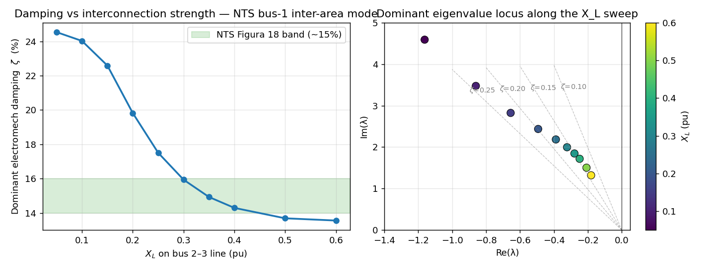

# genrou

*Synchronous machines — pydae-bps model.*

Round-rotor 6th-order synchronous machine — IEEE 1110-2019 Model 2.2 /
PSS/E `GENROU` / Anderson-Fouad formulation. Two damper windings on each
axis. Terminal-referred subtransient reactances.

## Why this model (and not `milano6ord`)

`milano6ord` carries Marconato/Sauer-Pai conventions: its stator
algebraic equations subtract the leakage $X_l$ from the subtransient
reactance,

$$0 = v_q + R_a i_q - e_q'' + (X_d'' - X_l)\,i_d \quad \text{(milano6ord)}$$

and its rotor equations include a cross-coupling term
$\frac{T_{d0}''}{T_{d0}'}\frac{X_d''}{X_d'}(X_d - X_d')$ on the d-axis
(and the mirror on the q-axis). These conventions match the *raw rotor*
parameters used in some textbook derivations, where $X_d''$ denotes the
flux behind the leakage.

The industry standard parameter tables — IEEE 1110-2019, IEEE 115-2019,
PSS/E `GENROU`, REE NTS Tabla 45 — quote $X_d''$ as the *terminal-referred*
total reactance (IEEE 115-2019 Eq. (88): $X_{ds} = X_{ads} + X_l$, so
$X_d''$ already includes the leakage contribution). Feeding NTS literals
$X_d'' = 0.269$, $X_l = 0.234$ into `milano6ord` produces an effective
stator reactance of $0.269 - 0.234 = 0.035$ — 7.7× too stiff — which
masquerades the inter-area mode damping. Users have been silently
patching this by setting $X_l = 0$ in their data files.

`genrou` is the clean Anderson-Fouad / IEEE 1110 Model 2.2 form:

$$0 = v_q + R_a i_q - e_q'' + X_d''\,i_d \quad \text{(genrou)}$$

with no $X_l$ parameter at all. Industry parameter tables drop straight
into it; the saturation form (additive on rotor flux, IEEE 1110 §6.3)
also matches the standard.

## Equations

### Auxiliary

$$v_d = V \sin(\delta - \theta), \quad v_q = V \cos(\delta - \theta)$$
$$\tau_e = (v_d + R_a i_d)\,i_d + (v_q + R_a i_q)\,i_q$$
$$\omega_s = \omega_{coi}$$

### Saturation (IEEE 1110 §6.3 — additive on rotor flux)

Given $S_{1.0}$, $S_{1.2}$ from a no-load saturation curve:

$$R = \sqrt{1.2\,S_{1.2}/S_{1.0}}, \quad
A_{sat} = \frac{1.2 - R}{1 - R}, \quad
B_{sat} = \frac{S_{1.0}}{(1 - A_{sat})^2}$$

Air-gap flux magnitude (with a $10^{-12}$ epsilon to guard $\sqrt{0}$ in
the Jacobian) and the saturation factor:

$$\psi_{AT} = \sqrt{e_q'^{\,2} + e_d'^{\,2} + \epsilon}$$
$$S(\psi_{AT}) = \frac{B_{sat}\,\max(\psi_{AT} - A_{sat},\,0)^2}{\psi_{AT}}$$
$$S_d = S(\psi_{AT}), \qquad S_q = \frac{X_q}{X_d}\,S(\psi_{AT})$$

This is the **additive** form: $S_d e_q'$ is added directly to the rotor
flux equation as an extra demagnetising term. The multiplicative form
$-e_q'(1 + S_d)$ used in some textbooks (and in `milano6ord`) is
algebraically equivalent only when no other terms multiply $e_q'$;
keeping the additive form makes the saturation contribution transparent.

### Dynamic equations (states: $\delta, \omega, e_q', e_d', e_q'', e_d''$)

$$\frac{d\delta}{dt} = \Omega_b (\omega - \omega_s) - K_\delta \delta$$
$$\frac{d\omega}{dt} = \frac{1}{2H}\bigl(\tau_m - \tau_e - D(\omega - \omega_s)\bigr)$$
$$T_{d0}' \frac{de_q'}{dt} = -e_q' - (X_d - X_d')\,i_d - S_d\,e_q' + v_f$$
$$T_{q0}' \frac{de_d'}{dt} = -e_d' + (X_q - X_q')\,i_q - S_q\,e_d'$$
$$T_{d0}'' \frac{de_q''}{dt} = -e_q'' + e_q' - (X_d' - X_d'')\,i_d$$
$$T_{q0}'' \frac{de_d''}{dt} = -e_d'' + e_d' + (X_q' - X_q'')\,i_q$$

Compared with `milano6ord`, the rotor equations are missing the
Marconato cross-coupling term
$\frac{T_{d0}''}{T_{d0}'}\frac{X_d''}{X_d'}(X_d - X_d')\,i_d$ on the
d-axis (and its q-axis mirror), and the additional $T_{AA}$ time
constant is absent.

### Algebraic equations (variables: $i_d, i_q, p_g, q_g$)

$$0 = v_q + R_a i_q - e_q'' + X_d''\,i_d$$
$$0 = v_d + R_a i_d - e_d'' - X_q''\,i_q$$
$$0 = i_d v_d + i_q v_q - p_g$$
$$0 = i_d v_q - i_q v_d - q_g$$

Note that $X_d''$ appears as-is, not as $X_d'' - X_l$.

## Parity with `milano6ord`

When `milano6ord` is fed $X_l = 0, T_{AA} = 0$ and saturation is off
($S_{1.0} = S_{1.2} = 0$), its stator equations coincide with `genrou`,
but the rotor cross-coupling is still present. Practically:

| Quantity | Agreement |
|---|---|
| $\delta, \omega, V, p_g, q_g, v_f, i_d, i_q, e_q'', e_d''$ | machine precision (terminal-referred quantities are unaffected by the cross-coupling) |
| $e_q', e_d'$ | within $\sim 1\%$ (cross-coupling biases the transient EMFs) |
| Electromechanical swing mode eigenvalues | $\lesssim 10^{-3}$ |
| Subtransient pole eigenvalues | differ by $\mathcal{O}(1\,\mathrm{s}^{-1})$ — structural |

The terminal operating point and the slow (electromechanical) dynamics
match; the fast subtransient dynamics differ structurally and are
*correct* in `genrou`, *approximate* in `milano6ord`.

## Porting from `milano6ord`

In the network HJSON, replace `type: "milano6ord"` with `type: "genrou"`,
then:

- **Delete** the `X_l` field. Do not move its value into anything else.
- **Delete** the `T_AA` field (genrou has no additional time constant).
- Saturation parameters `S_10`, `S_12` carry over unchanged.
- All other rotor parameters (`X_d, X_q, X1d, X1q, X2d, X2q, T1d0, T1q0,
  T2d0, T2q0`) are interpreted identically (terminal-referred).

Do not "translate" $X_l$ into $X_d''$. The genrou $X_d''$ slot is the
*terminal-referred* subtransient reactance that NTS / IEEE 115 / PSS/E
already publishes.

If your data source explicitly uses the Marconato convention (rare
outside `milano6ord` itself), keep using `milano6ord`. If you obtained
your parameters from a manufacturer test report, IEEE 115 short-circuit
identification, or any vendor power-systems database, you have IEEE /
terminal-referred values: use `genrou`.

## Usage

```python
from pydae.bps import BpsBuilder

grid = BpsBuilder("my_network.json")
grid.construct("my_system")
```

Network HJSON entry:

```hjson
syns: [
  {bus: "1", S_n: 1500e6, type: "genrou",
   X_d: 2.135, X_q: 2.046,
   X1d: 0.34,  T1d0: 6.47,
   X1q: 0.573, T1q0: 0.61,
   X2d: 0.269, T2d0: 0.022,
   X2q: 0.269, T2q0: 0.034,
   R_a: 0.0, H: 6.3, D: 0.0,
   S_10: 0.05, S_12: 0.20,
   F_n: 50.0, K_sec: 0.0, K_delta: 0.0,
   avr: {...}, gov: {...}, pss: {...}, lc: {...}}
]
```

## Parameters, inputs, states, outputs

### Parameters

| Symbol | Variable | Default | Units | Description |
|---|---|---|---|---|
| $S_n$ | `S_n` | 100000000.0 | VA | Nominal power |
| $F_n$ | `F_n` | 50.0 | Hz | Nominal frequency |
| $H$ | `H` | 5.0 | s | Inertia constant |
| $D$ | `D` | 0.0 | - | Damping coefficient |
| $X_d$ | `X_d` | 1.8 | pu-m | d-axis synchronous reactance |
| $X_q$ | `X_q` | 1.7 | pu-m | q-axis synchronous reactance |
| $X'_d$ | `X1d` | 0.3 | pu-m | d-axis transient reactance |
| $X'_q$ | `X1q` | 0.55 | pu-m | q-axis transient reactance |
| $X''_d$ | `X2d` | 0.2 | pu-m | d-axis subtransient reactance (terminal-referred) |
| $X''_q$ | `X2q` | 0.25 | pu-m | q-axis subtransient reactance (terminal-referred) |
| $T'_{d0}$ | `T1d0` | 8.0 | s | d-axis open-circuit transient time constant |
| $T'_{q0}$ | `T1q0` | 0.4 | s | q-axis open-circuit transient time constant |
| $T''_{d0}$ | `T2d0` | 0.03 | s | d-axis open-circuit subtransient time constant |
| $T''_{q0}$ | `T2q0` | 0.05 | s | q-axis open-circuit subtransient time constant |
| $R_a$ | `R_a` | 0.0 | pu-m | Armature resistance |
| $S_{1.0}$ | `S_10` | 0.0 | - | Saturation factor at E=1.0 (set 0 to disable) |
| $S_{1.2}$ | `S_12` | 0.0 | - | Saturation factor at E=1.2 |
| $K_{\delta}$ | `K_delta` | 0.0 | - | Reference-machine constant |
| $K_{sec}$ | `K_sec` | 0.0 | - | Secondary-frequency control participation |

### Inputs

| Symbol | Variable | Default | Units | Description |
|---|---|---|---|---|
| $p_m$ | `p_m` | 0.5 | pu-m | Mechanical power (replaced by LC/governor if attached) |
| $v_f$ | `v_f` | 1.0 | pu-m | Field voltage (replaced by AVR if attached) |

### Dynamic States

| Symbol | Variable | Units | Description |
|---|---|---|---|
| $\delta$ | `delta` | rad | Rotor angle |
| $\omega$ | `omega` | pu | Rotor speed |
| $e'_q$ | `e1q` | pu-m | q-axis transient EMF |
| $e'_d$ | `e1d` | pu-m | d-axis transient EMF |
| $e''_q$ | `e2q` | pu-m | q-axis subtransient EMF |
| $e''_d$ | `e2d` | pu-m | d-axis subtransient EMF |

### Algebraic States

| Symbol | Variable | Units | Description |
|---|---|---|---|
| $i_d$ | `i_d` | pu-m | d-axis current |
| $i_q$ | `i_q` | pu-m | q-axis current |
| $p_g$ | `p_g` | pu-m | Active-power injection (machine base) |
| $q_g$ | `q_g` | pu-m | Reactive-power injection (machine base) |

### Outputs

| Symbol | Variable | Units | Description |
|---|---|---|---|
| $\tau_e$ | `p_e` | pu-m | Air-gap (electrical) torque |
| $v_f$ | `v_f` | pu-m | Field voltage (echo) |
| $v_d$ | `v_d` | pu-m | d-axis terminal voltage |
| $v_q$ | `v_q` | pu-m | q-axis terminal voltage |
| $S_{at}$ | `S_at` | - | Saturation factor $S(\psi_{AT})$ |

## NTS validation — X_L sweep

The migrated NTS benchmark
(`benchmarks_public/nts/cases/base/nts_base.hjson`, bus-1 1500 MVA unit
with ST4B AVR + PSS2A) reproduces NTS Figura 18 over a sweep of the
bus 2–3 transmission-line reactance $X_L$:



| $X_L$ (pu) | $f$ (Hz) | $\zeta$ (%) |
|---:|---:|---:|
| 0.05 | 0.731 | 24.5 |
| 0.10 | 0.553 | 24.0 |
| 0.15 | 0.449 | 22.6 |
| 0.20 | 0.388 | 19.8 |
| 0.25 | 0.348 | 17.5 |
| 0.30 | 0.318 | 15.9 |
| 0.35 | 0.294 | 14.9 |
| 0.40 | 0.273 | 14.3 |
| 0.50 | 0.239 | 13.7 |
| 0.60 | 0.210 | 13.6 |

The dominant electromechanical-mode damping passes through the NTS
Figura 18 target band ($\zeta \approx 15\,\%$) at $X_L \in [0.30, 0.40]$
and decreases monotonically as the tie weakens — the expected behaviour
for an inter-area mode. The legacy `milano6ord` configuration with the
literal NTS $X_l = 0.234$ sits several percentage points above this band
throughout the sweep (over-damped because the effective stator
subtransient reactance collapses to $X_d'' - X_l = 0.035$).

## References

- IEEE Std 1110-2019, *IEEE Guide for Synchronous Generator Modeling
  Practices and Parameter Verification with Applications in Power
  System Stability Analyses*, §6.3 (Model 2.2).
- IEEE Std 115-2019, *IEEE Guide for Test Procedures for Synchronous
  Machines*, Eq. (88) on $X_{ds} = X_{ads} + X_l$.
- Anderson, P. M., Fouad, A. A., *Power System Control and Stability*,
  2nd ed., IEEE Press, 2003.
- PSS/E Model Library, `GENROU`.
- REE *Normas Técnicas de Supervisión* (NTS), Tabla 45 / 46 / 47.

## Source

- Module: `pydae.bps.syns.genrou`
- File: [`packages/pydae-bps/src/pydae/bps/syns/genrou.py`](https://github.com/pydae/pydae/tree/main/packages/pydae-bps/src/pydae/bps/syns/genrou.py)
