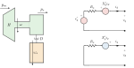

# milano3ord

*Synchronous machines — pydae-bps model.*

## Model description

Synchronous machine model of order 3 (Flux Decay Model).

**Auxiliar equations**

$$v_d = V \sin(\delta - \theta)$$
$$v_q = V \cos(\delta - \theta)$$
$$p_e = i_d \left(v_d + R_a i_d\right) + i_q \left(v_q + R_a i_q\right)$$
$$\omega_s = \omega_{coi}$$

**Dynamic equations**

$$\frac{ d\delta}{dt} = \Omega_b \left(\omega - \omega_s \right) - K_{\delta} \delta$$
$$\frac{ d\omega}{dt} = \frac{1}{2H} \left(p_m - p_e - D \left(\omega - \omega_s \right) \right)$$
$$\frac{ de'_q}{dt} = \frac{1}{T'_{d0}} \left(-e'_q K_{sat} - (X_d - X'_d)i_d + v_f \right)$$

**Algebraic equations**

$$0 = v_q + R_a i_q + X'_d i_d - e'_q$$
$$0 = v_d + R_a i_d - X'_q i_q$$
$$0 = i_d v_d + i_q v_q - p_g$$
$$0 = i_d v_q - i_q v_d - q_g$$

## Block diagram



## Usage

```hjson
syns: [{
  bus: "1", type: "milano3ord",
  S_n: 200e6, H: 5.0, D: 0.0,
  X_d: 1.8, X1d: 0.3, T1d0: 8.0,
  X_q: 1.7, X1q: 0.55, T1q0: 0.4,
  R_a: 0.01, K_sat: 1.0,
  K_delta: 0.01, K_sec: 0.0
}]
```

## Parameters, inputs, states, outputs

### Parameters

| Symbol | Variable | Default | Units | Description |
|---|---|---|---|---|
| $S_n$ | `S_n` | 100000000.0 | VA | Nominal power |
| $F_n$ | `F_n` | 50.0 | Hz | Nominal frequency |
| $H$ | `H` | 5.0 | s | Inertia constant |
| $D$ | `D` | 1.0 | s | Damping coefficient |
| $X_d$ | `X_d` | 1.8 | pu-m | d-axis synchronous reactance |
| $X_q$ | `X_q` | 1.7 | pu-m | q-axis synchronous reactance |
| $X'_d$ | `X1d` | 0.3 | pu-m | d-axis transient reactance |
| $X'_q$ | `X1q` | 0.55 | pu-m | q-axis transient reactance |
| $T'_{d0}$ | `T1d0` | 8.0 | s | d-axis open circuit transient time constant |
| $T'_{q0}$ | `T1q0` | 0.4 | s | q-axis open circuit transient time constant |
| $R_a$ | `R_a` | 0.01 | pu-m | Armature resistance |
| $K_{sat}$ | `K_sat` | 1.0 | - | Saturation factor |
| $K_{\delta}$ | `K_delta` | 0.0 | - | Reference machine constant |
| $K_{sec}$ | `K_sec` | 0.0 | - | Secondary frequency control participation |

### Inputs

| Symbol | Variable | Default | Units | Description |
|---|---|---|---|---|
| $p_m$ | `p_m` | 0.5 | pu-m | Mechanical power |
| $v_f$ | `v_f` | 1.0 | pu-m | Field voltage |

### Dynamic States

| Symbol | Variable | Default | Units | Description |
|---|---|---|---|---|
| $\delta$ | `delta` |  | rad | Rotor angle |
| $\omega$ | `omega` |  | pu | Rotor speed |
| $e'_q$ | `e1q` |  | pu-m | q-axis transient voltage |

### Algebraic States

| Symbol | Variable | Default | Units | Description |
|---|---|---|---|---|
| $i_d$ | `i_d` |  | pu-m | d-axis current |
| $i_q$ | `i_q` |  | pu-m | q-axis current |
| $p_g$ | `p_g` |  | pu-m | Active power |
| $q_g$ | `q_g` |  | pu-m | Reactive power |

### Outputs

| Symbol | Variable | Default | Units | Description |
|---|---|---|---|---|
| $p_e$ | `p_e` |  | pu-m | Electrical power |
| $v_f$ | `v_f` |  | pu-m | Field voltage |
| $p_m$ | `p_m` |  | pu-m | Mechanical power |


## Source

- Module: `pydae.bps.syns.milano3ord`
- File: [`packages/pydae-bps/src/pydae/bps/syns/milano3ord.py`](https://github.com/pydae/pydae/tree/main/packages/pydae-bps/src/pydae/bps/syns/milano3ord.py)
