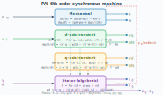

# pai6ord

*Synchronous machines — pydae-bps model.*

## Model description

PAI 6th-order synchronous machine.

A sixth-order model following the PAI (Power & Energy Automation Inc.)
formulation.  The key difference from [milano6ord](milano6ord.md) is in how
the subtransient quantities are represented: instead of separate subtransient
voltage EMFs ($e''_q$, $e''_d$), this model uses **subtransient flux linkages**
($\psi_{2d}$, $\psi_{2q}$) directly as dynamic states, connected to the stator
equations through coupling coefficients $\gamma_{d1}$, $\gamma_{d2}$,
$\gamma_{q1}$, $\gamma_{q2}$ derived from the machine reactances.

**Auxiliary coefficients**

$$\gamma_{d1} = \frac{X''_d - X_l}{X'_d - X_l}, \quad
  \gamma_{d2} = \frac{1 - \gamma_{d1}}{X'_d - X_l}$$

$$\gamma_{q1} = \frac{X''_q - X_l}{X'_q - X_l}, \quad
  \gamma_{q2} = \frac{1 - \gamma_{q1}}{X'_q - X_l}$$

**Auxiliary equations**

$$v_d = V\sin(\delta - \theta), \quad v_q = V\cos(\delta - \theta)$$
$$\psi_d = e'_q - (X'_d - X_l)\left(\gamma_{d1}\,i_d - \gamma_{d2}\,\psi_{2d}\right)$$
$$\psi_q = -e'_d + (X'_q - X_l)\left(\gamma_{q1}\,i_q - \gamma_{q2}\,\psi_{2q}\right)$$
$$p_e = i_d(v_d + R_a i_d) + i_q(v_q + R_a i_q)$$

**Dynamic equations**

$$\frac{d\delta}{dt} = \Omega_b(\omega - \omega_s) - K_\delta\,\delta$$

$$\frac{d\omega}{dt} = \frac{1}{2H}\bigl(p_m - p_e - D(\omega - \omega_s)\bigr)$$

$$\frac{de'_q}{dt} = \frac{1}{T'_{d0}}\left(-e'_q - (X_d - X'_d)\bigl(i_d - \gamma_{d2}\,\psi_{2d}
  - (1 - \gamma_{d1})\,i_d + \gamma_{d2}\,e'_q\bigr) + v_f\right)$$

$$\frac{de'_d}{dt} = \frac{1}{T'_{q0}}\left(-e'_d + (X_q - X'_q)\bigl(i_q - \gamma_{q2}\,\psi_{2q}
  - (1 - \gamma_{q1})\,i_q - \gamma_{q2}\,e'_d\bigr)\right)$$

$$\frac{d\psi_{2d}}{dt} = \frac{1}{T''_{d0}}\left(-\psi_{2d} + e'_q - (X'_d - X_l)\,i_d\right)$$

$$\frac{d\psi_{2q}}{dt} = \frac{1}{T''_{q0}}\left(-\psi_{2q} - e'_d - (X'_q - X_l)\,i_q\right)$$

**Algebraic equations**

$$0 = R_a\,i_d + \omega\,\psi_q + v_d$$
$$0 = R_a\,i_q - \omega\,\psi_d + v_q$$
$$0 = i_d\,v_d + i_q\,v_q - p_g$$
$$0 = i_d\,v_q - i_q\,v_d - q_g$$

## Block diagram



## Usage

```hjson
syns: [{
  bus: "1", type: "pai6",
  S_n: 200e6, H: 5.0, D: 0.0,
  X_d: 1.8,  X_q: 1.7,
  X1d: 0.3,  X1q: 0.55,
  X2d: 0.2,  X2q: 0.25,
  X_l: 0.1,
  T1d0: 8.0, T1q0: 0.4,
  T2d0: 0.03, T2q0: 0.05,
  R_a: 0.01,
  K_delta: 0.01, K_sec: 0.0
}]
```

## Parameters, inputs, states, outputs

### Parameters

| Symbol | Variable | Default | Units | Description |
|---|---|---|---|---|
| $S_n$ | `S_n` | 100e6 | VA | Nominal power |
| $F_n$ | `F_n` | 50.0 | Hz | Nominal frequency |
| $H$ | `H` | 5.0 | s | Inertia constant |
| $D$ | `D` | 1.0 | pu | Damping coefficient |
| $X_d$ | `X_d` | 1.8 | pu-m | d-axis synchronous reactance |
| $X_q$ | `X_q` | 1.7 | pu-m | q-axis synchronous reactance |
| $X'_d$ | `X1d` | 0.3 | pu-m | d-axis transient reactance |
| $X'_q$ | `X1q` | 0.55 | pu-m | q-axis transient reactance |
| $X''_d$ | `X2d` | 0.2 | pu-m | d-axis subtransient reactance |
| $X''_q$ | `X2q` | 0.25 | pu-m | q-axis subtransient reactance |
| $X_l$ | `X_l` | 0.1 | pu-m | Leakage reactance |
| $T'_{d0}$ | `T1d0` | 8.0 | s | d-axis open-circuit transient time constant |
| $T'_{q0}$ | `T1q0` | 0.4 | s | q-axis open-circuit transient time constant |
| $T''_{d0}$ | `T2d0` | 0.03 | s | d-axis open-circuit subtransient time constant |
| $T''_{q0}$ | `T2q0` | 0.05 | s | q-axis open-circuit subtransient time constant |
| $R_a$ | `R_a` | 0.01 | pu-m | Armature resistance |
| $K_\delta$ | `K_delta` | 0.0 | - | Reference machine constant |
| $K_{sec}$ | `K_sec` | 0.0 | - | Secondary frequency control participation |

### Inputs

| Symbol | Variable | Default | Units | Description |
|---|---|---|---|---|
| $p_m$ | `p_m` | 0.5 | pu-m | Mechanical power |
| $v_f$ | `v_f` | 1.0 | pu-m | Field voltage |

### Dynamic States

| Symbol | Variable | Units | Description |
|---|---|---|---|
| $\delta$ | `delta` | rad | Rotor angle |
| $\omega$ | `omega` | pu | Rotor speed |
| $e'_q$ | `e1q` | pu-m | d-axis transient EMF |
| $e'_d$ | `e1d` | pu-m | q-axis transient EMF |
| $\psi_{2d}$ | `psi2d` | pu-m | d-axis subtransient flux linkage |
| $\psi_{2q}$ | `psi2q` | pu-m | q-axis subtransient flux linkage |

### Algebraic States

| Symbol | Variable | Units | Description |
|---|---|---|---|
| $i_d$ | `i_d` | pu-m | d-axis stator current |
| $i_q$ | `i_q` | pu-m | q-axis stator current |
| $p_g$ | `p_g` | pu-m | Active power injected into the bus |
| $q_g$ | `q_g` | pu-m | Reactive power injected into the bus |

### Outputs

| Symbol | Variable | Units | Description |
|---|---|---|---|
| $p_e$ | `p_e` | pu-m | Electrical (air-gap) power |

## Comparison with milano6ord

| Feature | milano6ord | pai6ord |
|---------|-----------|---------|
| Subtransient states | $e''_q$, $e''_d$ (EMFs) | $\psi_{2d}$, $\psi_{2q}$ (flux linkages) |
| Stator equations | Use $e''_q$, $e''_d$ directly | Use $\psi_d$, $\psi_q$ from coupling coefficients |
| Saturation | PSAT two-point ($S_{10}$, $S_{12}$) | None |
| `T_AA` parameter | Yes (d-axis additional) | No |
| `descriptions()` | Yes | Not yet implemented |

## Source

- Module: `pydae.bps.syns.pai6ord`
- File: [`packages/pydae-bps/src/pydae/bps/syns/pai6ord.py`](https://github.com/pydae/pydae/tree/main/packages/pydae-bps/src/pydae/bps/syns/pai6ord.py)
