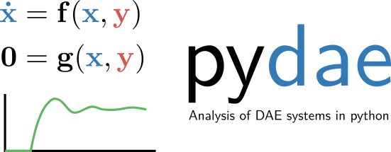

pydae - DAE equations in Python
===============================

**pydae** is an open source (MIT) collection of Python functions useful
for analysis and simulation of Diferential Algebraic Equations (DAE) systems .

View `source code`_ of pydae!

.. _`source code`: https://github.com/pydae/pydae

Contents
--------

.. toctree::
    :maxdepth: 2

    about
    getting_started
    user_guide
    jupyter

